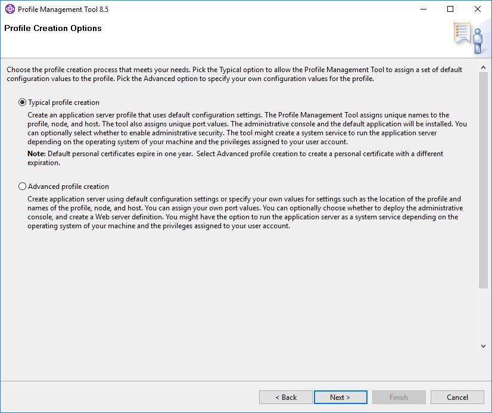

# Criando uma Aplicacão Java WebSphere Portal com MyEclipse Blue

Tutorial demonstrando como criar uma aplicação **Java WebSphere Portal** com o **MyEclipse Blue IDE**.

Um dos principais desafios no desenvolvimento de aplicações **Java WebSphere Portal** está relacionado ao custo de licença da IDE **[IBM Rational Application Developer for WebSphere Software (RAD)](https://www.ibm.com/us-en/marketplace/rad-for-websphere-software/details)**. A ferramenta **RAD** pois os componentes necessários para o desenvolvimento de uma aplicação de portal, além do próprio servidor de aplicação **WebSphere**. Entretanto, o custo de licença é bem alto o que pode inviabilizar, principalmente sendo um projeto de baixo ou médio porte.

Portanto, uma solução viável seria a utilização da ferramenta [MyEclipse](https://www.genuitec.com/products/myeclipse/download/websphere-developers/), pois a IDE possui um custo de licença mais accessível, comparado ao RAD. Neste tutorial veremos que podemos utilizar o **servidor de aplicação WebSphere** integrado com a **IDE MyEclipse Blue**.

Você sabia que é possível utilizar em ambiente de desenvolvimento/testes o **WebSphere® Application Server** free livre de cobranças? A **IBM®** oferece aos desenvolvedores um **ambiente de desenvolvimento WebSphere free runtime**. Vejamos abaixo algumas features disponíveis:

* Free para uso por desenvolvedores
* Processo de registro obrigatório (porém free)
* WebSphere versions **8.0**, **8.5** e **9.0** disponíveis
* Integra-se perfeitamente ao [MyEclipse](https://www.genuitec.com/products/myeclipse/features/websphere/) WebSphere (Blue)
* Disponível somente para as plataformas **Linux** e **Windows**

## Pré-Requisitos

1. Instalar o **WebSphere for Developers**. Abaixo o link para as versões disponíveis:
  
    [Download WAS 8.0, 8.5, 9.0 for developers](https://developer.ibm.com/wasdev/downloads/#asset/WAS_traditional_for_Developers)
    
2. Instalar a IDE [MyEclipse](https://www.genuitec.com/products/myeclipse/download/)
3. Conhecimento no desenvolvimento **Web Java EE** e **Java Core cross-platform**

## Instalando o WebSphere Application Server

O **WebSphere Application Server** da IBM ajuda a você criar, deployar e rodar aplicações com flexibilidade, segurança e dentro de um ambiente **Java EE-certified runtime**. 

O **WebSphere Application Server traditional na versão 9.0**, permite aos desenvolvedores desenvolverem e testarem suas aplicações antes de migrarem para o ambiente de produção livre de cobranças e sem suporte. É permitido o uso do produto em ambientes de teste e produção, porém há uma limitação de **2 GB** de **JVM heap** compartilhada entre todas as instâncias de application servers para esta licença.

As versões **WebSphere Application Server for Developers, 8.0 e 8.5** também permitem o desenvolvimento livre de cobranças e sem suporte, porém essas versões não são permitidas em ambientes produtivos.

Para realizar a instalação do WebSphere, siga os passos definidos no link abaixo:

[Instalation IBM WebSphere Application Server](https://developer.ibm.com/wasdev/downloads/#asset/WAS_traditional_for_Developers)

## Criando Application Server Profiles

Para **rodar aplicações Java** dentro do WebSphere é necessário a **criação/configuração** de uma instância do application server profile. Para isto, é necessário a utilização da ferramenta **Profile Management Tool**, responsável pela criação de **manageprofiles**. 
Vejamos o passo a passo para criação:

1. Inicie a ferramenta **Profile Management Tool** através do menu **Start** do Windows:

    

2. Clique em **Create** na aba **Profiles** para criar um novo profile:

3. Selecione a opção **Application server** e clique em **Next**:

    

4. Selecione **Typical profile creation** ou **Advanced profile creation** e clique em **Next**:

    
    
    A opção **Typical profile creation** cria um profile através da configuração default. Utilizando **Advanced profile creation**, você pode especificar suas próprias opções de configuração. Neste tutorial, utilizaremos a opção **Typical profile creation**.

5. Defina o nome da instância do profile e clique em **Next**:

    

    **Oservação:**
    O nome do profile deve ser único com as seguintes restrições:
    
    * Não pode conter espaços
    * Não pode conter caracteres especiais, barras (/) ou contra barras (\)
    

